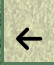

# Micks Football Quiz

## Introduction
This is a project I have been working on as part of the JavaScript assessment with Code Institute. This is an interactive football quiz game that is designed to allow for users to test their knowledge of Football in either the Premier League, Scottish Premiership or Spanish La Liga. Users can aslo set their difficulty, with the easy selection only having 5 questions, while intermediate and hard selections have 10 questions with incrementing difficulty. This quiz is responsive for small screens from a width of 280px up to large screens of 1200px +.

You can access the page live via github pages on the url below.
https://mickjitsu.github.io/football_quiz/

## Table of Contents
- [Introduction](#introduction)
- [User Experience](#user-experience)
  - [User Stories](#user-stories)
- [Design](#design)
  - [Colour Scheme](#colour-scheme)
  - [Typography](#typography)
  - [Imagery](#imagery)
  - [Wireframes](#wireframes)
- [Features](#features)
  - [Existing Features](#existing-features)
  - [Features to be Added](#features-to-be-added)
- [Testing](#testing)
  - [Validation of Code](#validation-of-code)
  - [Manual Testing](#manual-testing)
  - [Bug resolutions](#bugs)
- [Technologies Used](#technologies-used)
- [Deployment](#deployment)
- [Credits](#credits)
- [Acknowledgements](#acknowledgements)

## User Experience
### User Stories
User Goals

- Navigature clearly and effectively across the site
- Select their chosen league and difficulty
- Take a quiz on their chosen league and difficulty
- Have full control and be able to return to the home page at any stage to change the quiz type

Site Owner Goals

- Ensure the website is seamless for the user
- Ensure the user can play the quiz on all devices
- Allow the user to play in their chosen league and in a difficulty that suits them
- Provide a fun experience for the user to test their knowledge
- Allow the user to partake in the quiz using any device that supports an internet browser and javascript

## Design
### Colour Scheme
I used the website color-hex.com to find an appropriate colour scheme and decided on the shade and colour which suited the background image of foorball greenery. Along with the background image, I used the colours #598766, rgb(251,243,213,0.7), rgb(89, 135, 102, 0.7), #ffffff, #8FB68F, antiquewhite, #008000 and #FF0000

### Typography
I chose to stick with a sans-serif font type for the entirety of the webpage as it is very clear and easy to read for all users. The body font was 'Roboto'.
### Imagery
Not much imagerey was used throughout the page however the .png images for the league logos and the trophies were from Wikipedia.

### Wireframes
I was unable to install balsamiq wireframing tool due to restrictions on the computer I am using, so I opted for a free tool online wireframe.cc . Although it was more difficult to use and didn't allow me plan as effectively as I would have liked, I made some rough wireframes for each page.

## Features

### User choice to choose league and difficulty

### Trophy for 10/10 or 5/5 score

### Back arrow to return home at any time

### 3 second loading welcome screen

### Correct and incorrect button selection

## Features to be Added
I would like to add a timer feature to the quiz to make the harder difficulties not only be difficult due to the questions asked but also the time limit given to answer them.

I would also like to add more leagues to the quiz for more variety of questions.

## Testing

### Validation of Code
Index w3 validator

About page w3 validator

JShint validator for JS

### Lighthouse
Lighthouse results, it's worth noting that at time of testing my internet speed was not great, with a download speed of roughly 7mbps.

Common issue seems to be with image size and type used for mobile versions of the website. In the future I will procure more modern images suited for web design rather than jpg or png.

### Wave Webaim - accessibility testing
Initially there was one error due to the label tag used for the nav toggle. More information on bug section.

### Manual Testing

Here I have tested all the features on each and every page of my website. Please see the results below.

Our goals were met in this testing as all pages are directly accessible and easy to find for the user, with clear descriptions where to find certain information along with an acknowledgement when a contact form is sent.

This was tested using a google pixel 6 pro, iphone 11 and responsive mode on a large PC monitor.

Format of the table below is as follows:

# Manual Testing Document

| Feature Being Tested          | Expected Outcome                                              | Testing Performed                                | Actual Outcome                                      | Result (Pass or Fail) |
|-------------------------------|---------------------------------------------------------------|--------------------------------------------------|-----------------------------------------------------|-----------------------|
| Welcome Page Load Time        | 3-second load before the main page is visible                  | Manually loaded the welcome page                | Page loaded after 3 seconds                        | PASS                  |
| Start Match Button           | Modal should appear if league/difficulty not chosen            | Manually clicked start match button             | Modal appeared as expected                          | PASS                  |
| Start Match Button           | Quiz should start after selecting league/difficulty and clicking start | Manually clicked start match button      | Quiz started as expected                            | PASS                  |
| Choose Difficulty Button     | Should direct to index page                                   | Manually clicked choose difficulty button       | Directed to index page as expected                  | PASS                  |
| Choose League Button         | Should open a page to choose your league                       | Manually clicked choose league button          | Page to choose league opened as expected            | PASS                  |
| Tutorial Button              | Should open a modal with instructions on how to start the match | Manually clicked tutorial button              | Modal with instructions opened as expected          | PASS                  |
| Premier League Button        | Should set the league to Premier League                        | Manually clicked Premier League button         | League set to Premier League as expected            | PASS                  |
| La Liga Button               | Should set the league to La Liga                               | Manually clicked La Liga button                | League set to La Liga as expected                   | PASS                  |
| Scottish League Button       | Should set the league to the Scottish League                   | Manually clicked Scottish League button        | League set to Scottish League as expected           | PASS                  |
| Easy Button                  | Should set the difficulty to easy                              | Manually clicked Easy button                   | Difficulty set to easy as expected                  | PASS                  |
| Medium Button                | Should set the difficulty to medium                            | Manually clicked Medium button                 | Difficulty set to medium as expected                | PASS                  |
| Hard Button                  | Should set the difficulty to hard                              | Manually clicked Hard button                   | Difficulty set to hard as expected                  | PASS                  |
| Next Button (Quiz)           | Should forward to the next question                            | Manually clicked Next button on quiz           | Forwarded to the next question as expected          | PASS                  |
| Back Arrow                   | Should bring the user back to the home page                    | Manually clicked back arrow                    | Brought back to the home page as expected           | PASS                  |
| Return Home Button           | Should return the user to the home page                        | Manually clicked return home button            | Returned to the home page as expected               | PASS                  |
| Answer Buttons (Quiz)        | Should work on each and every quiz question                    | Manually clicked answer buttons on quiz        | Answer buttons worked on all questions as expected  | PASS                  |
| Incorrect buttons        | Should glow red if an incorrect answer is chosed                 | Manually clicked answer buttons on quiz        | Incorrect glows red when selected  | PASS                  |
| Correct buttons        | Should glow green if an incorrect answer is chosed                 | Manually clicked answer button on quiz      | Correct glows red when selected  | PASS                  |
| Prem league trophy       | Should appear if user gets all questions right                 | Manually answered all questions correctly    | league trophy photo appears  | PASS                  |
| Scottish league trophy       | Should appear if user gets all questions right                 | Manually answered all questions correctly    | league trophy photo appears  | PASS                  |
| La Liga trophy       | Should appear if user gets all questions right                 | Manually answered all questions correctly    | league trophy photo appears  | PASS                  |
| Close modal buttons      | Should close the modals once they are clicked                | Manually clicked the close toggle for each modal    | Modal close as expected  | PASS                  |

## Bug resolutions

When writing the javascript code for this website, I came across numerous bugs. One initial bug that I came across was the next button was shifting the text on the quiz up towards the top of the div, once it was made visible. To get over this, I instead used a fixed height for the main screen div, so that it didn't need to grow when the next button was made visible.

Another issue I had was that I couldn't shuffle the quiz questions and answers using solely a for loop. I then searched online and found a way this can be done. I made changes to the code so that it would shuffle both the questions and answers and implemented it to the shuffle loop in my JS code. I got the initial help and inspiration for this in the link below.

https://www.javatpoint.com/how-to-shuffle-an-array-in-javascript

## Technologies Used

This project was done solely using HTML, CSS and JavaScript along with vs code and gitpod.

**Cloning the repository**

To clone the repository, you'll need Git installed on your computer. I

Open your terminal or command prompt.
Navigate to the directory where you want to clone the repository.
Run the clone command:

**Forking the repository**

To Fork this repository and have a version of this on your personal account to make changes, customisation and amendments, please do the following.

Go to the GitHub page of the repository : https://github.com/Mickjitsu/football_quiz/tree/main
Click on the "Fork" button, usually found at the top-right corner of the page.

After forking, you will have a copy of the repository in your GitHub account. You can then clone your forked version to your local machine by following the "Cloning the Repository" steps, using the URL of your fork.

To view the repository on the local machine:

1. Navigate to the Project Directory: : cd //football_quiz

2. Open the Website: Open the main index.html page in a browser or the folder in a code editory

## Deployment

**Deploying on Github Pages**
Firstly clone or fork the repository following the steps above. Once that is done, you will need to set up GitHub Pages. To do this:
 In your repository, navigate to the "Settings" tab.
   - Click on the "Pages" section on the left sidebar.
   - Under the "Source" section, select the branch you want to deploy from (usually `main` or `master`) and click "Save".
   - GitHub will provide you with a link to your live site.

## Credits

The images of this site came from wikipedia.com

The guidance I had on this was from the current course I am doing on code institute, along with memory of previous courses I have completed on Udemy which helped with the liges of modals.

## Acknowledgements
I would like to thank my partner for encouraging me to continue on when I was struggling at the start of the course, my family for encouraging me to keep studying despite going through a bereavement, and my mentor Matt for helping me along the way with pre, mid point and final calls! This year has been incredibly hard, however making the time to get this done no matter the issues that I face around me make it all worth while.

[Back to top](#introduction)